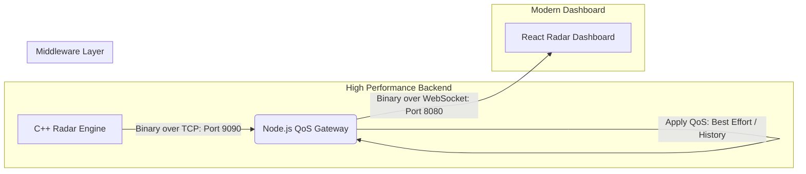

# 🛰️ Stream-Radar WebDDS: High-Performance Tactical Simulation

> **Sistem Simulasi Radar Real-Time Berkinerja Tinggi Berbasis Binary WebDDS (Data Distribution Service).**

Sistem ini mendemonstrasikan kekuatan arsitektur **Data-Centric Binary Streaming** yang dirancang untuk kebutuhan militer dan taktis. Dikembangkan dengan **C++ murni** sebagai mesin simulasi, **Node.js** sebagai *Middleware QoS Aware*, dan **React** dengan **OpenLayers** sebagai dashboard visualisasi 60 FPS.

---

## 🏗️ Arsitektur Aliran Data (Binary Pipeline)

Sistem ini tidak menggunakan JSON standar yang lambat, melainkan jalur pipa biner murni (**Packed Binary**) untuk memastikan latency minimal (< 1ms) bahkan saat menangani puluhan ribu objek.



---

## 🚀 Fitur Utama & Keunggulan

- **📡 Binary Zero-Copy**: Transmisi data biner mentah (41 bytes per track) yang mengurangi penggunaan bandwidth hingga 75% dibanding JSON.
- **⚙️ Middleware-Level QoS**: Implementasi kebijakan *Quality of Service* langsung pada Gateway tanpa membebani aplikasi pusat.
- **📊 60 FPS Rendering**: Pengoptimalan render OpenLayers untuk menangani ribuan pergerakan objek secara simultan tanpa *frame-drop*.
- **🎮 Warfare-Speed Simulation**: Simulasi kapal lincah dengan kecepatan 100-500 Knots dan sebaran acak dinamis di area Laut Jawa.

---

## 🛡️ Kebijakan QoS (Quality of Service)

Sistem ini mengadopsi standar WebDDS untuk memastikan integritas data dalam situasi *bandwidth* terbatas:

| Kebijakan QoS | Implementasi | Fungsi |
| :--- | :--- | :--- |
| **RELIABILITY** | `BEST_EFFORT` | Memprioritaskan kecepatan data terbaru. Paket lama akan dibuang (*dropped*) jika jaringan sibuk untuk mencegah penumpukan (*lag*). |
| **HISTORY** | `KEEP_LAST (1)` | Hanya mengirimkan 1 posisi terbaru untuk setiap objek. Menghemat memori browser secara signifikan. |
| **DEADLINE** | `1000ms` | Memberikan penanda *timeout* jika sebuah objek radar tidak mengirimkan update dalam 1 detik. |

---

## 📡 Rincian Topik & Pub/Sub

Komunikasi antar komponen didasarkan pada saluran (**Topic**) spesifik yang dikelola oleh Middleware:

| Nama Topik | Publisher | Subscriber | Fungsi Data |
| :--- | :--- | :--- | :--- |
| **`RadarTrackTopic`** | **C++ Engine** | **React Dashboard** | Penyaluran data posisi, kecepatan, dan klasifikasi kapal secara biner. |
| **`CommandTopic`** | **React Dashboard** | **C++ Engine** | Jalur instruksi untuk mengubah parameter simulasi (Jumlah target) secara *real-time*. |

---

## 🛠️ Teknologi yang Digunakan

| Komponen | Teknologi |
| :--- | :--- |
| **Engine (Backend)** | C++ 17, GCC, POSIX Sockets (High Performance) |
| **Middleware** | Node.js, WebSocket (Binary Relay Layer) |
| **Frontend** | React, TypeScript, OpenLayers (Map Engine) |
| **Bundler** | Rspack (High Speed Build) |
| **Deployment** | Docker & Docker-Compose (Containerized Stack) |

---

## 📦 Panduan Instalasi (Container-First)

Proyek ini telah dikontainerisasi penuh menggunakan Docker agar tidak ada masalah ketergantungan *library* C++.

### 1. Prasyarat
- **Docker Desktop** (untuk Windows/Mac) atau **Docker Engine** (untuk Linux)

### 2. Langkah Instalasi & Menjalankan
```bash
# Clone repository
git clone https://github.com/awiuweoww/stream-radar-webdds.git
cd stream-radar-webdds

# Jalankan seluruh stack (C++, Gateway, & Frontend)
docker-compose up --build
```
*Akses Dashboard: http://localhost:3000*

---

## 🗺️ Perjalanan Paket Data (End-to-End)

1.  **C++ Engine (`be-stream-radar-cpp`)**: Menciptakan koordinat kapal secara matematis, membungkusnya ke dalam *Struct* memori 41-byte (Strict Aligned), dan menembakkannya via TCP ke Gateway.
2.  **Gateway (`gateway-bridge`)**: Bertindak sebagai *Middleware*. Ia membaca ukuran biner, menempelkan stempel **QoS Metadata**, dan melakukan *Relay* biner tersebut ke Dashboard melalui jalur WebSocket.
3.  **Radar API (`radarApi.ts`)**: Menerima paket biner dalam bentuk `ArrayBuffer`. Menggunakan `DataView` untuk membedah byte demi byte menjadi objek Javascript dalam hitungan mikrosekon.
4.  **Radar Simulation Hook (`useRadarSimulation.ts`)**: Memasukkan data ke dalam OpenLayers Feature Map. Jika ada kapal yang baru muncul, ia dikloning; jika kapal sudah ada, ia hanya diperbarui posisinya untuk performa maksimal.

---

## ⚡ Cara Menjalankan (Development)

Terdapat dua cara untuk menjalankan sistem ini:

### A. Menggunakan Docker (Rekomendasi)
Ini adalah cara paling cepat dan stabil:
```bash
docker-compose up --build
```

### B. Menjalankan Lokal (Non-Docker)
Cocok untuk debugging cepat tanpa perlu rebuild kontainer.

1.  **Gateway Bridge**:
    ```bash
    cd gateway-bridge && npm install && node server.js
    ```
2.  **Frontend**:
    ```bash
    cd fe-stream-radar-webdds && pnpm install && pnpm dev
    ```
3.  **C++ Engine**:
    *Pastikan sudah terinstal g++ (MinGW di Windows atau GCC di Linux/Mac).*
    ```bash
    cd be-stream-radar-cpp
    g++ -o RadarPublisher src/Publisher.cpp -O3
    ./RadarPublisher
    ```


---
