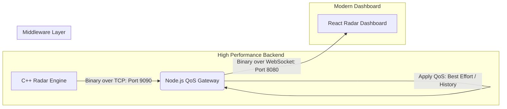

# Stream-Radar WebDDS: High-Performance Tactical Simulation

> **Sistem Simulasi Radar Real-Time Berkinerja Tinggi Berbasis Binary WebDDS (Data Distribution Service).**

Sistem ini mendemonstrasikan kekuatan arsitektur **Data-Centric Binary Streaming** yang dirancang untuk kebutuhan militer dan taktis. Dikembangkan dengan **C++ murni** sebagai mesin simulasi, **Node.js** sebagai _Middleware QoS Aware_, dan **React** dengan **OpenLayers** sebagai dashboard visualisasi 60 FPS.

---

## Arsitektur Aliran Data (Binary Pipeline)

Sistem ini tidak menggunakan JSON standar yang lambat, melainkan jalur pipa biner murni (**Packed Binary**) untuk memastikan latency minimal (< 1ms) bahkan saat menangani puluhan ribu objek.



---

## Fitur Utama & Keunggulan

- **Binary Zero-Copy**: Transmisi data biner mentah (41 bytes per track) yang mengurangi penggunaan bandwidth hingga 75% dibanding JSON.
- **Middleware-Level QoS**: Implementasi kebijakan _Quality of Service_ langsung pada Gateway tanpa membebani aplikasi pusat.
- **60 FPS Rendering**: Pengoptimalan render OpenLayers untuk menangani ribuan pergerakan objek secara simultan tanpa _frame-drop_.
- **Warfare-Speed Simulation**: Simulasi kapal lincah dengan kecepatan 100-500 Knots dan sebaran acak dinamis di area Laut Jawa.

---

## Kebijakan QoS (Quality of Service)

Sistem ini mengadopsi standar WebDDS untuk memastikan integritas data dalam situasi _bandwidth_ terbatas:

| Kebijakan QoS   | Implementasi    | Fungsi                                                                                                                             |
| :-------------- | :-------------- | :--------------------------------------------------------------------------------------------------------------------------------- |
| **RELIABILITY** | `BEST_EFFORT`   | Memprioritaskan kecepatan data terbaru. Paket lama akan dibuang (_dropped_) jika jaringan sibuk untuk mencegah penumpukan (_lag_). |
| **HISTORY**     | `KEEP_LAST (1)` | Hanya mengirimkan 1 posisi terbaru untuk setiap objek. Menghemat memori browser secara signifikan.                                 |
| **DEADLINE**    | `1000ms`        | Memberikan penanda _timeout_ jika sebuah objek radar tidak mengirimkan update dalam 1 detik.                                       |

---

## Rincian Topik & Pub/Sub

Komunikasi antar komponen didasarkan pada saluran (**Topic**) spesifik yang dikelola oleh Middleware:

| Nama Topik            | Publisher           | Subscriber          | Fungsi Data                                                                           |
| :-------------------- | :------------------ | :------------------ | :------------------------------------------------------------------------------------ |
| **`RadarTrackTopic`** | **C++ Engine**      | **React Dashboard** | Penyaluran data posisi, kecepatan, dan klasifikasi kapal secara biner.                |
| **`CommandTopic`**    | **React Dashboard** | **C++ Engine**      | Jalur instruksi untuk mengubah parameter simulasi (Jumlah target) secara _real-time_. |

### Lokasi Implementasi Kode

| Jalur                 | Aksi          | File & Fungsi Utama                    |
| :-------------------- | :------------ | :------------------------------------- |
| **RadarTrack** (Data) | **Publish**   | `Publisher.cpp` -> Loop Utama (`send`) |
| **RadarTrack** (Data) | **Subscribe** | `radarApi.ts` -> `socket.onmessage`    |
| **Command** (Control) | **Publish**   | `radarApi.ts` -> `updateTargetCount`   |
| **Command** (Control) | **Subscribe** | `Publisher.cpp` -> `handle_commands()` |

### Cuplikan Kode (Syntax)

#### A. Topik RadarTrack (Binary Data)

*   **Publish (Backend C++)**:
    ```cpp
    // 1. Kirim 4-byte Header (Size)
    uint32_t totalSize = tracks.size() * sizeof(TrackData);
    send(sock, &totalSize, 4, 0);

    // 2. Kirim Payload Biner
    send(sock, (const char*)tracks.data(), totalSize, 0);
    ```

*   **Subscribe (Frontend TypeScript)**:
    ```typescript
    socket.onmessage = (event) => {
      const view = new DataView(event.data); // data = ArrayBuffer
      const trackId = view.getInt32(0, true);
      const lat = view.getFloat64(4, true);
      // ... ekstrak field lainnya
    };
    ```

#### B. Topik Command (Control)

*   **Publish (Frontend TypeScript)**:
    ```typescript
    const cmd = JSON.stringify({ action: 'START', value: 500 });
    socket.send(cmd);
    ```

*   **Subscribe (Backend C++)**:
    ```cpp
    char buffer[1024];
    int bytes = recv(sock, buffer, 1024, MSG_DONTWAIT);
    if (bytes > 0) {
        // Parsing pesan JSON Command
    }
    ```

### Bedah Struktur Paket Biner (41 Bytes)

Setiap satu data track radar dikirimkan dalam paket biner presisi tinggi untuk efisiensi maksimal:

| Offset | Tipe Data | Nama Field    | Ukuran  | Deskripsi                                |
| :----- | :-------- | :------------ | :------ | :--------------------------------------- |
| `0`    | `Int32`   | **Track ID**  | 4 Bytes | Identifier unik objek radar.             |
| `4`    | `Float64` | **Latitude**  | 8 Bytes | Koordinat lintang posisi objek.          |
| `12`   | `Float64` | **Longitude** | 8 Bytes | Koordinat bujur posisi objek.            |
| `20`   | `Float32` | **Altitude**  | 4 Bytes | Ketinggian objek (feet/meters).          |
| `24`   | `Float32` | **Speed**     | 4 Bytes | Kecepatan objek (Knots).                 |
| `28`   | `Float32` | **Heading**   | 4 Bytes | Arah hadap objek (Degree).               |
| `32`   | `Int64`   | **Timestamp** | 8 Bytes | Waktu produksi data (UNIX Epoch).        |
| `40`   | `Uint8`   | **Class**     | 1 Byte  | Klasifikasi (`1`: Hostile, `0`: Friend). |

---

## Teknologi yang Digunakan

| Komponen             | Teknologi                                     |
| :------------------- | :-------------------------------------------- |
| **Engine (Backend)** | C++ 17, GCC, POSIX Sockets (High Performance) |
| **Middleware**       | Node.js, WebSocket (Binary Relay Layer)       |
| **Frontend**         | React, TypeScript, OpenLayers (Map Engine)    |
| **Bundler**          | Rspack (High Speed Build)                     |
| **Deployment**       | Docker & Docker-Compose (Containerized Stack) |

---

## Panduan Instalasi (Container-First)

Proyek ini telah dikontainerisasi penuh menggunakan Docker agar tidak ada masalah ketergantungan _library_ C++.

### 1. Prasyarat

- **Docker Desktop** (untuk Windows/Mac) atau **Docker Engine** (untuk Linux)

### 2. Langkah Instalasi & Menjalankan

```bash
# Clone repository
git clone https://github.com/awiuweoww/stream-radar-webdds.git
cd stream-radar-webdds

# Jalankan seluruh stack (C++, Gateway, & Frontend)
docker-compose up --build
```

_Akses Dashboard: http://localhost:3000_

---

## Perjalanan Paket Data (End-to-End)

1.  **C++ Engine (`be-stream-radar-cpp`)**: Menciptakan koordinat kapal secara matematis, membungkusnya ke dalam _Struct_ memori 41-byte (Strict Aligned), dan menembakkannya via TCP ke Gateway.
2.  **Gateway (`gateway-bridge`)**: Bertindak sebagai _Middleware_. Ia membaca ukuran biner, menempelkan stempel **QoS Metadata**, dan melakukan _Relay_ biner tersebut ke Dashboard melalui jalur WebSocket.
3.  **Radar API (`radarApi.ts`)**: Menerima paket biner dalam bentuk `ArrayBuffer`. Menggunakan `DataView` untuk membedah byte demi byte menjadi objek Javascript dalam hitungan mikrosekon.
4.  **Radar Simulation Hook (`useRadarSimulation.ts`)**: Memasukkan data ke dalam OpenLayers Feature Map. Jika ada kapal yang baru muncul, ia dikloning; jika kapal sudah ada, ia hanya diperbarui posisinya untuk performa maksimal.
5.  **Upstream Control (Command Flow)**: Dashboard mengirim instruksi JSON (misal: jumlah target) ke Gateway, yang kemudian diteruskan ke C++ Engine untuk menyesuaikan beban simulasi secara _real-time_ tanpa koneksi terputus.

---

## Panduan Pengembangan (Developer Guide)

Jika Anda ingin menambahkan fitur baru atau menghubungkan sensor baru ke sistem WebDDS ini, ikuti panduan berikut:

### 1. Persiapan Infrastruktur

- **Port Terbuka**: Pastikan Port `9090` (TCP Input) dan `8080` (WS Output) tidak diblokir firewall.
- **Header Biner**: Pastikan pengiriman data biner selalu diawali dengan 4-byte Header (Little Endian) yang menunjukkan panjang payload.

### 2. Implementasi Publisher (Sisi Backend)

Untuk mengirimkan data ke WebDDS:

1.  Buka koneksi socket TCP ke `localhost:9090`.
2.  Bungkus data Anda ke dalam buffer biner (disarankan menggunakan _Strict Struct Alignment_).
3.  Kirim 4-byte ukuran data, diikuti oleh seluruh payload biner.
4.  Lakukan _looping_ sesuai kebutuhan frekuensi simulasi (misal: 10Hz - 60Hz).

### 3. Implementasi Subscriber (Sisi Frontend)

Untuk menerima data dari WebDDS:

1.  Lakukan inisialisasi WebSocket ke `ws://localhost:8080/webdds`.
2.  Atur `socket.binaryType = 'arraybuffer'` untuk memastikan data diterima sebagai biner mentah, bukan string.
3.  Gunakan `DataView` untuk melakukan ekstraksi field berdasarkan spesifikasi 41-byte di atas.

---

## Cara Menjalankan (Development)

Terdapat dua cara untuk menjalankan sistem ini:

### A. Menggunakan Docker (Rekomendasi)

Ini adalah cara paling cepat dan stabil:

```bash
docker-compose up --build
```

### B. Menjalankan Lokal (Non-Docker)

Cocok untuk debugging cepat tanpa perlu rebuild kontainer.

1.  **Gateway Bridge**:
    ```bash
    cd gateway-bridge && npm install && node server.js
    ```
2.  **Frontend**:
    ```bash
    cd fe-stream-radar-webdds && pnpm install && pnpm dev
    ```
3.  **C++ Engine**:
    _Pastikan sudah terinstal g++ (MinGW di Windows atau GCC di Linux/Mac)._
    ```bash
    cd be-stream-radar-cpp
    g++ -o RadarPublisher src/Publisher.cpp -O3
    ./RadarPublisher
    ```

---
